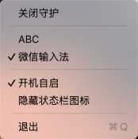

# Input Method Lock

[English](#english)

macOS 状态栏小工具，锁定当前输入法，防止意外切换。



## 背景

在使用 Mac 时，系统或某些应用会自动切换输入法（比如从英文切到中文，或反过来），导致打字时出现意想不到的中英文混合。这个工具会在输入法被意外切走时，立即将其切换回你选定的输入法。

## 功能

- **锁定输入法** — 选择一个目标输入法，任何非预期的切换都会被自动纠正
- **开关守护** — 随时启用/禁用，不重启应用
- **开机自启** — 可选开机自动启动，在系统设置中管理
- **隐藏图标** — 隐藏状态栏图标，守护仍在后台运行，下次启动自动恢复

## 系统要求

- macOS 15.7+
- Xcode 26.3+

## 构建

```bash
git clone https://github.com/a471640241/InputMethod-Lock.git
cd InputMethodGuard
open InputMethodGuard.xcodeproj
```

在 Xcode 中点击 Build & Run（⌘R）即可运行。

## 原理

应用启动后在状态栏显示一个图标，通过监听 `kTISNotifySelectedKeyboardInputSourceChanged` 系统通知来感知输入法变化。当检测到当前输入法与用户选定的目标输入法不一致时，调用 Carbon `TISSelectInputSource` 将其切回。

## 许可证

MIT License

---

<a id="english"></a>

# Input Method Lock

A macOS menu-bar utility that locks your input method and prevents accidental switching.


## Background

On macOS, the system or certain apps may automatically switch your input method (e.g., from English to Chinese or vice versa), causing unexpected mixed-language text while typing. This tool detects unintended input method changes and immediately switches back to your chosen one.

## Features

- **Lock input method** — Select a target input method; any unintended switch is automatically corrected
- **Toggle guard** — Enable or disable at any time without restarting the app
- **Launch at login** — Optionally start automatically on login, managed via System Settings
- **Hide icon** — Hide the menu-bar icon while the guard continues running in the background; icon reappears on next launch

## Requirements

- macOS 15.7+
- Xcode 26.3+

## Build

```bash
git clone https://github.com/a471640241/InputMethod-Lock.git
cd InputMethodGuard
open InputMethodGuard.xcodeproj
```

Press Build & Run (⌘R) in Xcode to run.

## How It Works

The app displays a menu-bar icon on launch and listens for the `kTISNotifySelectedKeyboardInputSourceChanged` system notification to detect input method changes. When the current input method differs from the user-selected target, it calls Carbon `TISSelectInputSource` to switch back.

## License

MIT License
